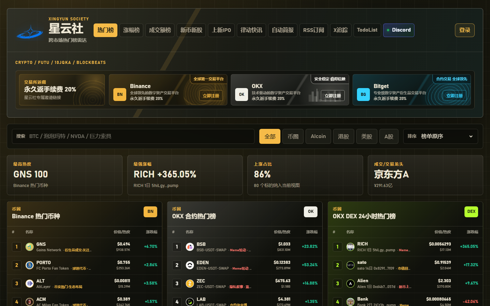
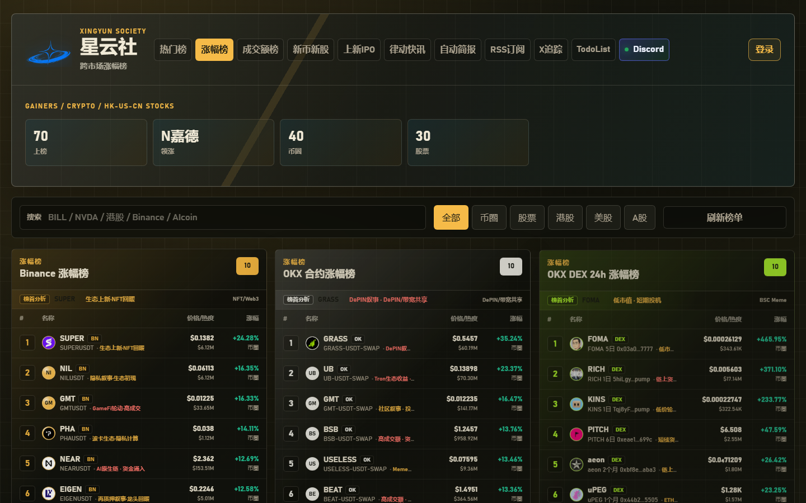
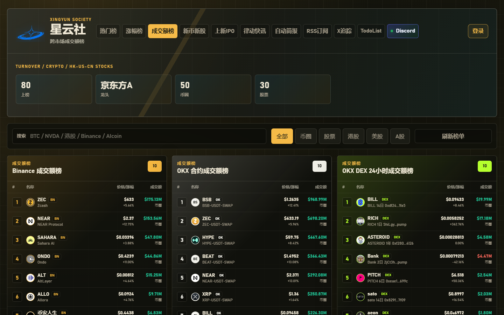
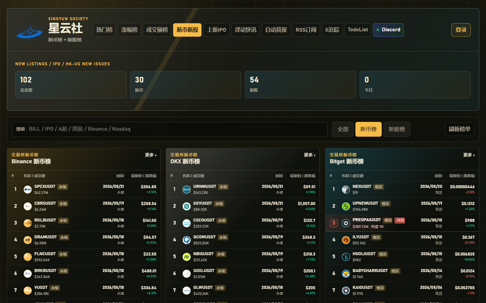
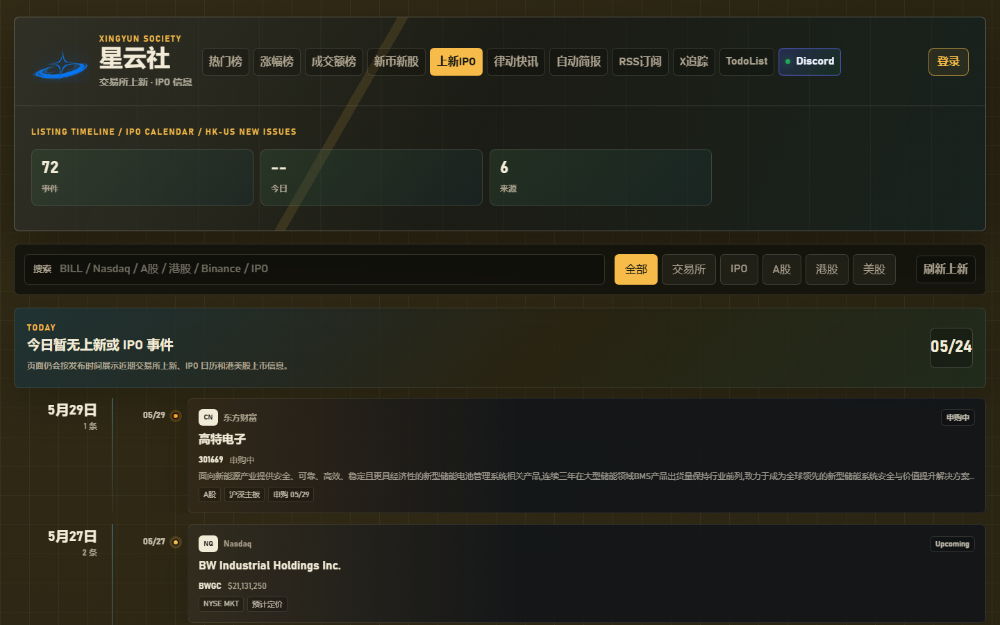
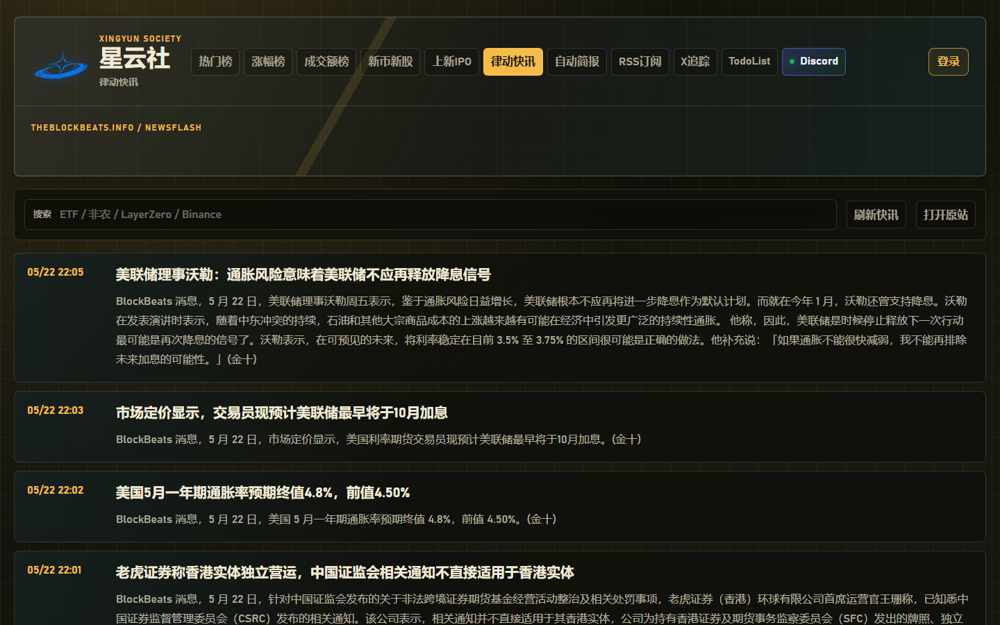
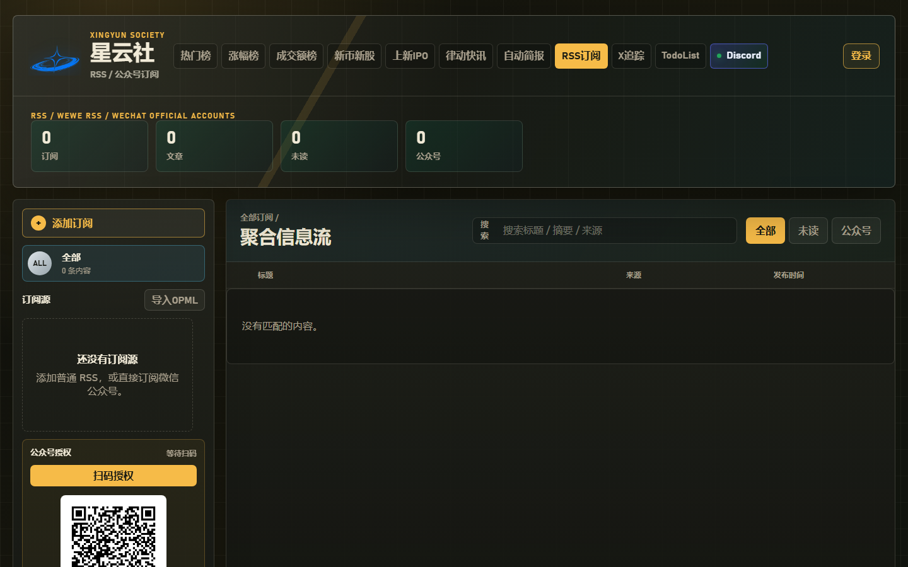

# 星云社 · 跨市场热榜雷达

> Local-first cross-market trading intelligence dashboard for crypto, stocks, RSS, X/KOL tracking, AI insights, and desktop alerts.

星云社是一个面向交易员和信息流研究者的跨市场热榜仪表盘。它把加密货币交易所、链上 DEX、港股、美股、A 股、交易所上新、IPO、新股新币、律动快讯、RSS/公众号、X KOL 动态和 TodoList 聚合到同一套本地优先的工作台里。

如果这个项目对你有帮助，欢迎点一个 Star 支持一下，也欢迎加入 [Discord 社群](https://discord.gg/mKyCwtHW) 交流数据源、交易信息流自动化和产品建议。

> **使用声明**：本项目仅供学习使用，如要商用，请获得本人授权；如需二次商业发行或作为商业服务的一部分使用，也请先获得作者本人授权。
> **风险提示**：页面数据和 AI 分析仅作信息聚合与研究辅助，不构成任何投资建议。

## 页面截图

| 热门榜 | 涨幅榜 |
| --- | --- |
|  |  |

| 成交额榜 | 新币新股 |
| --- | --- |
|  |  |

| 上新 IPO | 律动快讯 |
| --- | --- |
|  |  |

| RSS / 公众号订阅 |
| --- |
|  |

## 功能概览

- **热门榜**：Binance、OKX、Bitget、AIcoin、OKX DEX、币安钱包、港股、美股、A 股同花顺热榜；各榜保持独立卡片和原有布局。
- **涨幅榜**：按交易所和市场拆分展示，不做混合榜；支持榜首异动提醒。
- **成交额榜**：按交易所和市场独立展示资金最集中的标的。
- **新币新股**：交易所新币、新合约、IPO、港美 A 新股集中展示，高热标的红色标注。
- **上新 IPO**：按发布时间聚合交易所上新、合约上线、IPO 日历和上市动态。
- **律动快讯**：独立快讯流，支持重要市场信息桌面弹窗。
- **自动简报**：读取自动化任务生成的交易简报，并支持 GitHub Raw JSON 兜底。
- **RSS / 公众号**：支持 RSS、Atom、JSON Feed，以及参考 WeWe RSS 逻辑的微信公众号订阅。
- **X KOL 追踪**：追踪指定 KOL 动态，正文和引用分开展示，支持桌面提醒。
- **公链生态监控**：按 L0-L3 市场树跟踪新链生态、市场 Top5、潜在发币项目和高价值变化提醒，内置 Robinhood Chain 样例。
- **多周期结构监控**：持续跟踪 AIcoin、个人 X 和币安钱包 4 小时榜入池标的；链上币按链 ID 与合约地址解析，低于 1000 万美元 24 小时成交额的标的统一剔除。
- **News Trade**：按发布时间展示事件与链上标的，包含安全检查、手续费/滑点预估、钱包授权和人工确认后的买入准备流程。
- **TodoList**：项目分组、任务增删改查、今日提醒，按用户隔离数据。
- **账号系统**：账号密码、邮箱验证码、Google OAuth，支持用户资料和交易所 UID 绑定。
- **桌面弹窗**：市场异动、快讯、RSS、X 动态、Todo 提醒、公众号授权失效均可弹窗。
- **AI 分析**：可接入 DeepSeek、OpenAI、Moonshot、Qwen、Claude、Gemini 等兼容模型做榜单叙事解析。

## 返佣注册链接

如果这个项目对你有帮助，也欢迎通过下面的邀请链接注册交易所。广告语：**永久返手续费 20%**。

| 交易所 | 邀请链接 |
| --- | --- |
| Binance | [立即注册 Binance](https://www.binance.com/join?ref=WF7KWSF5) |
| OKX | [立即注册 OKX](https://www.bjwebptyiou.com/join/51629076) |
| Bitget | [立即注册 Bitget](https://partner.bitgetapps.com/bg/xy8888) |

## 打赏支持

如果你想支持星云社继续维护，可以用微信打赏。非常感谢。


## Discord 社群

欢迎加入星云社 Discord 社群，一起交流市场信息、自动化工作流和产品建议：

[加入 Discord](https://discord.gg/mKyCwtHW)

## 本地运行

需要 Python 3.11+ 和 Node.js 18+。Node.js 用于运行与起爆台完全一致的结构策略引擎；缺少 Node.js 时，结构监控不会使用降级版或旧版规则。

```powershell
pip install -r requirements.txt
python server.py --host 127.0.0.1 --port 8765
```

浏览器打开：

```text
http://127.0.0.1:8765/
```

## Docker 本地部署

1. 准备配置文件：

```powershell
Copy-Item .env.production.example .env.production
```

2. 生成字段加密密钥，写入 `.env.production` 的 `XINGYUN_FIELD_ENCRYPTION_KEY`：

```powershell
python -c "import base64,secrets;print(base64.urlsafe_b64encode(secrets.token_bytes(32)).decode())"
```

3. 按需配置 `.env.production`：

```text
XINGYUN_PUBLIC_BASE_URL=http://127.0.0.1:8765
XINGYUN_COOKIE_SECURE=0
XINGYUN_LOAD_ENV_EXAMPLE=0
DEEPSEEK_API_KEY=
EMAIL_SMTP_HOST=
GOOGLE_CLIENT_ID=
GOOGLE_CLIENT_SECRET=
```

4. 启动 Docker：

```powershell
docker compose up -d --build
```

也可以使用项目脚本：

```powershell
.\docker-start.ps1
```

5. 检查服务：

```powershell
curl http://127.0.0.1:8765/api/health
```

常用命令：

```powershell
docker compose ps
docker compose logs -f
docker compose restart
docker compose down
```

完整上线说明见 [docs/DEPLOYMENT.md](docs/DEPLOYMENT.md)。

## 结构监控与起爆台策略

“监控 → 多周期结构”和起爆台共用仓库中的当前策略实现，不维护第二套监控专用规则。服务端通过 `tools/dragon_wave_monitor_bridge.js` 调用 `dragon-wave-engine.js`、`dragon-wave-cases.js`、`dragon-wave-data.js`、`dragon-wave-feedback.js` 和 `dragon-wave-vision.js`，因此后续策略优化会自动同步到结构监控。

链上标的使用“链 ID + 合约地址”作为第一身份，行情按 Binance Wallet K 线、可选的 OKX OnchainOS DEX K 线、GeckoTerminal OHLCV 轮换；DexScreener 用于解析主池并聚合同一合约的流动性与 24 小时成交额。Robinhood Chain 的 `4663`、BSC、Ethereum、Base、Solana 等常用链均有显式映射。极新代币尚未形成日线时会保留已经可用的分钟、小时和 4 小时数据，不再因为单个周期历史不足让整张卡片失败。

默认扫描 1 分钟、5 分钟、15 分钟、1 小时、4 小时和日线；1 小时、4 小时识别出的三角、降楔等有效结构突破按 B 点处理。主升浪或主升浪预期、人工反馈、多周期共振以及已确认案例的回归保护，也都由同一策略引擎统一判定。

Docker 镜像已内置 Node.js；直接本地运行时请确保 `node --version` 可用，也可以通过 `DRAGON_WAVE_NODE_BINARY` 指定 Node.js 可执行文件。结构监控接口为 `/api/price-structures`，起爆台页面为 `/dragon-wave.html`。

## 配置说明

敏感配置只放在本地 `.env` 或 `.env.production`，不要提交到 GitHub。

常用环境变量：

- `XINGYUN_FIELD_ENCRYPTION_KEY`：本地数据库敏感字段加密密钥。
- `DEEPSEEK_API_KEY` / `LLM_API_KEY`：AI 榜单分析。
- `EMAIL_SMTP_*`：邮箱验证码登录。
- `GOOGLE_CLIENT_ID` / `GOOGLE_CLIENT_SECRET`：Google OAuth 登录。
- `X_BEARER_TOKEN`：X KOL 官方 API。
- `WECHAT_*`：微信公众号订阅授权。
- `OKX_*` / `BITGET_*` / `AICOIN_*`：交易所和客户端数据源配置。
- `OKX_DEX_API_KEY` / `OKX_DEX_SECRET_KEY` / `OKX_DEX_PASSPHRASE`：可选的 OKX OnchainOS 行情密钥，用于增加链上合约 K 线备用源；未配置时自动跳过。
- `CHAIN_ECOSYSTEM_REFRESH_SECONDS`：公链生态后台扫描间隔，默认 300 秒；数据源连续失败时会自动退避。
- `XINGYUN_DISABLE_CHAIN_ECOSYSTEM_MONITOR`：设为 `1` 可暂停公链生态后台扫描。
- `GITHUB_TOKEN`：可选，仅用于提高手动添加项目仓库的 GitHub 公共接口额度。

## 公链生态监控

在“监控 → 公链生态”中可查看三阶段公链列表、L0-L3 细分市场、每个市场 Top5、潜在发币池及证据来源。自动扫描使用 GeckoTerminal、DEX Screener、DefiLlama、Blockscout 和 GitHub 的公开接口；也可以手动添加公链、项目或证据，系统会把二者合并后重新评估。

桌面端只推送四类高价值变化：公链阶段升级、新细分市场、Top1 连续两轮确认变更，以及流动性/成交量/交易笔数显著放大。代币形成有效交易只更新市场状态和排名，不弹窗、不播报。首次成功扫描仅建立基线，不补发历史提醒；某个数据源失败时保留上一份完整快照，也不会据此触发阶段或龙头变化。

## 钉钉热门币监控机器人

钉钉推送是独立进程：它复用价格监控接口已经计算好的 AICoin 热门币、最近 7 日前高和预警轮次，但拥有单独的 Webhook、加签密钥和发送状态。Discord 是否配置或发送成功不会影响钉钉。

1. 在目标钉钉群中添加“自定义机器人”，安全设置选择“加签”，保存 Webhook 和 `SEC...` 开头的密钥。创建流程见[钉钉开放平台文档](https://open.dingtalk.com/document/orgapp/custom-robot-access)。
2. 把下面配置加入本地 `.env`：

```dotenv
DINGTALK_PRICE_WATCH_WEBHOOK_URL=https://oapi.dingtalk.com/robot/send?access_token=你的令牌
DINGTALK_PRICE_WATCH_SECRET=SEC你的加签密钥
```

3. 保持主行情监控服务运行，先发送连接测试：

```powershell
.\start-dingtalk-price-watch.ps1 -TestMessage
```

4. 测试成功后启动持续监控：

```powershell
.\start-dingtalk-price-watch.ps1
```

只检查一轮可使用 `-Once`。首次启动默认记录当前预警轮次但不补发旧消息；如需推送当前仍在前高附近的信号，可首次使用 `-SendExisting`。独立发送状态保存在 `.runtime-cache/dingtalk-price-watch-state.json`，钉钉发送失败时不会推进状态，下一轮会自动重试。

## 隐私与公开仓库说明

这个仓库只提交源码、示例配置、公开素材和页面截图。以下本地文件默认被 `.gitignore` 或 `.dockerignore` 排除：

- `.env`、`.env.local`、`.env.production`
- `.runtime-cache/`
- `desktop-private/`
- `node_modules/`
- `release/`
- `dist-backend/`
- `__pycache__/`

本地数据库、微信授权 token、桌面端私有配置、AI API Key、邮箱授权码、Google OAuth Secret、交易所 Cookie/Token 都不应该进入公开仓库。

## 桌面端

项目包含 Electron 壳，可打包 Windows `.exe` 和 macOS `.app` / `.dmg`。

```powershell
npm install
npm run desktop:dev
npm run desktop:build:win
```

macOS 打包需在 macOS 环境中执行：

```bash
npm run desktop:build:mac
```

桌面端会启动本地后端并复用同一套页面和接口。桌面弹窗能力在普通网页、Windows 桌面端和 macOS 桌面端中共用同一套通知链路。

## 数据来源

项目会聚合多个公开页面、公开接口或用户本地授权后的数据源，包括但不限于：

- Binance、OKX、Bitget、OKX DEX、AIcoin
- 富途、同花顺、东方财富
- BlockBeats
- RSS / 微信公众号
- X / Twitter

不同数据源稳定性和可访问性会受网络环境、接口变动、地区访问限制影响。项目内置缓存和兜底逻辑，但不保证任何数据源持续可用。

## 安全说明

- 密码使用 PBKDF2 哈希存储。
- 用户邮箱、手机号、Google 标识、交易所 UID、模型 API Key 等敏感字段会做本地字段级加密。
- 关键登录和管理操作会写入审计日志。
- 生产环境建议开启 HTTPS，并设置 `XINGYUN_COOKIE_SECURE=1`。
- 不要把 `.runtime-cache`、`.env`、`.env.production` 传到公开仓库。

## 许可

Copyright (c) 2026 星云社。

本项目仅供学习、研究和个人使用。未经作者本人授权，不得用于商业用途、商业分发、SaaS 服务、付费产品、企业内部商业化部署或任何以盈利为目的的再发布。

如需商用授权，请通过 Discord 或 GitHub 联系作者。
# QQ 后台群消息通道

QQ 群监控默认通过本机 NapCat / OneBot 11 接口工作，不需要 QQ 窗口保持可见。系统使用 WebSocket 接收实时群消息，并定时调用 `get_group_msg_history` 回补服务重启或短暂断线期间的消息；群名、发送人过滤、币种提取、去重、结构监控入池和微信转发仍由原有业务链路处理。

安全约束：HTTP 与 WebSocket 必须只监听 `127.0.0.1`，两个接口使用相同 Token，禁止将端口暴露到局域网或公网。运行配置位于 `.env`：`QQ_ONEBOT_HTTP_URL`、`QQ_ONEBOT_WS_URL`、`QQ_ONEBOT_TOKEN`。确认 OneBot 连通后保持 `QQ_UI_FALLBACK_ENABLED=0`，避免重新依赖窗口或 OCR。

`QQ_ONEBOT_RECOVERY_ENABLED` 默认必须保持为 `0`。这样 OneBot 断线只会显示通道不可用，不会结束、隐藏启动或抢占用户手动登录的 QQ。只有使用独立 QQ 账号的无人值守环境才应显式设为 `1`；即使开启，恢复脚本也只管理 NapCat 自己的进程树，检测到普通 QQ 正在运行时会跳过后台拉起。
